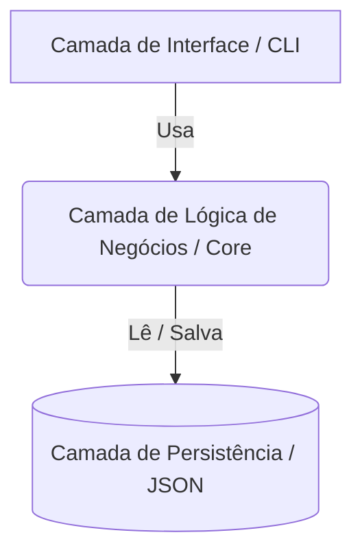
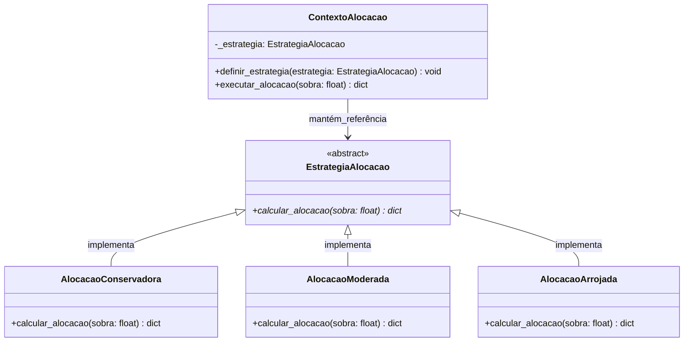
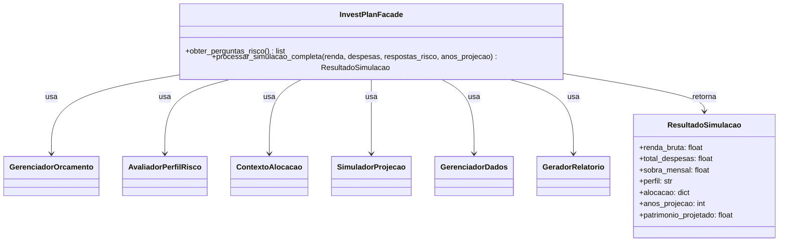
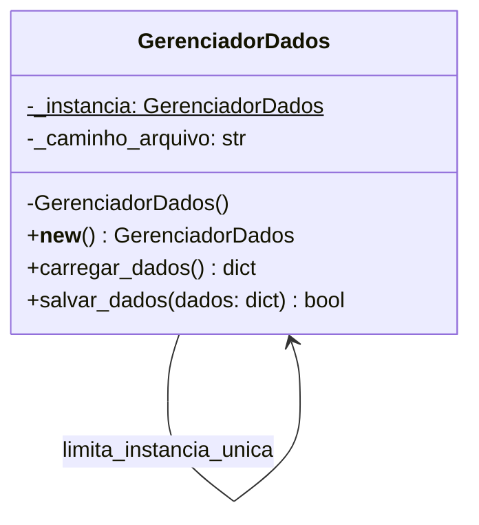

# Projeto da Aplicação e Arquitetura — InvestPlan

## 1. Registro de Decisões Arquiteturais (ADR) e Histórico

Para garantir o rastreamento das decisões e o alinhamento com os requisitos de engenharia, todas as mudanças estruturais e padronizações estão registradas abaixo:

| Data | Decisão / Alteração | Motivo e Trade-offs | Responsável |
|---|---|---|---|
| 30/05/2026 | Definição do Padrão Strategy para Alocação | Necessidade de evitar estruturas condicionais complexas e permitir fácil expansão de novos perfis no futuro. | Felipe |
| 30/05/2026 | Isolamento da Lógica de Negócios (Core) | Separar a matemática financeira da interface do terminal (CLI) para viabilizar testes automatizados isolados na Sprint 4. | Felipe |
| 30/05/2026 | Adoção de Clean Code funcional | Proibição de comentários inline para forçar a equipe a usar nomes de variáveis autodescritivas. | Felipe |
| 31/05/2026 | Adoção do Git Flow Simplificado e Commits Semânticos | Garantir a integridade do código em desenvolvimento paralelo e padronizar o histórico de alterações para auditoria rápida. | Elder |
| 31/05/2026 | Escolha de Interface via Linha de Comando (CLI) | Maximizar a velocidade de desenvolvimento e portabilidade a custo zero, aceitando o trade-off de uma experiência visual limitada (UX). | Elder |
| 31/05/2026 | Implementação do Padrão Facade na Interface | Desacoplar a camada visual das regras de negócio, centralizando o fluxo e permitindo futuras trocas de interface sem impactar o Core. | Elder |

---

## 2. Padrões de Codificação e Gestão de Qualidade

> **Responsável:** Felipe (Clean Code), Elder (Controle de Versão), Guilherme (Tipagem e Tratamento de Erros)

### 2.1 Diretrizes de Clean Code e Nomenclatura (Felipe)
O código base do InvestPlan deve focar na clareza estrutural e ser autodocumentado. Para garantir o mais alto nível de legibilidade e manutenção, a equipe deve seguir rigorosamente as seguintes regras na escrita do código Python:

* **Proibição de Comentários em Linha (Uso restrito a Docstrings):** O código não deve conter comentários explicativos em linha (`#`) para justificar lógicas complexas. Se um trecho de código precisa de um comentário em linha para ser entendido, ele deve ser refatorado. No entanto, o uso de *docstrings* (`"""`) é permitido e encorajado exclusivamente para documentar o propósito de classes, contratos de interfaces públicas e retornos de funções.
* **Nomenclatura Autodescritiva:** A clareza do sistema dependerá da escolha dos nomes. Variáveis, funções e classes devem revelar exatamente sua intenção (ex: usar `calcular_capacidade_poupanca()` em vez de `calc_cp()`).
* **Funções de Responsabilidade Única (SRP):** Cada função deve realizar apenas uma operação. Funções extensas devem ser quebradas em métodos menores.

### 2.2 Diretrizes de Controle de Versão e Git Flow Simplificado (Elder)
Para garantir a integridade do código e permitir o desenvolvimento paralelo sem conflitos destrutivos, a equipe adotará um modelo derivado do Git Flow, simplificado para a dinâmica do projeto:

* **Estrutura de Branches:**
  * `main`: Produção. Contém apenas código 100% estável e testado. Protegida contra commits diretos.
  * `develop`: Integração. Branch de consolidação do trabalho da equipe onde ocorrem as preparações para entregas de sprint.
  * `feature/*`: Desenvolvimento de funcionalidades (ex: `feature/calculo-orcamento`, `feature/interface-cli`). Criadas a partir de `develop` e mescladas via Pull Request (PR) após revisão por outro membro da equipe.
* **Padronização de Commits (Commits Semânticos):** Mensagens de commit devem ser claras e usar prefixos normatizados para facilitar a leitura automática do histórico:
  * `feat:` Quando uma nova funcionalidade é adicionada (ex: `feat: implementa loop principal da CLI`).
  * `fix:` Quando uma correção de bug é realizada (ex: `fix: corrige validacao de input de renda`).
  * `refactor:` Mudança no código que não altera comportamento (ex: `refactor: renomeia variaveis para clareza`).
  * `docs:` Alterações exclusivas na documentação (ex: `docs: atualiza adr da arquitetura`).

### 2.3 Diretrizes de Type Hinting
O uso de indicações de tipo (*Type Hinting*) é obrigatório em toda a base de código do InvestPlan, em conformidade com a PEP 484. A adoção desta prática visa mitigar erros em tempo de design, documentar nativamente as assinaturas do sistema e facilitar a análise estática por ferramentas de linting.

* **Tipagem de Parâmetros e Retornos:** Todas as funções e métodos devem declarar explicitamente o tipo de seus argumentos e o tipo do valor de retorno, inclusive retornos nulos (`None`).
* **Coleções Estruturadas:** Para dicionários, listas e tuplas, deve-se utilizar as definições do módulo `typing` para especificar o conteúdo das coleções.
* **Flexibilidade Controlada:** O uso de `Union` ou `Optional` deve ser empregado quando um parâmetro ou retorno puder assumir múltiplos tipos ou valores nulos.

Exemplos:
```python

from typing import Dict, List, Optional, Any

def calcular_liquida(bruta: float, tipo_regime: str) -> float:
    pass

def extrair_dados_persistidos() -> Optional[Dict[str, Any]]:
    pass
```

### 2.4 Política Global de Tratamento de Erros
O sistema adota uma postura defensiva no manejo de exceções para garantir a resiliência da aplicação em ambiente de terminal (CLI), impedindo interrupções abruptas da execução causadas por falhas internas ou por entradas de dados inválidas.

* **Proibição de Captura Genérica (*Bare Except*):** É vedada a utilização de blocos `except:` vazios ou desprovidos de classe de erro. Toda captura de exceção deve especificar a classe exata do erro esperado (ex: `ValueError`).
* **Isolamento por Exceções de Negócio:** Falhas decorrentes de violações diretas de regras de negócio devem disparar exceções customizadas, herdadas de uma classe base unificada da aplicação.
* **Ciclo de Recuperação na Interface:** Erros de digitação ou falhas de conversão cometidos pelo usuário devem ser tratados localmente por meio de loops de repetição na camada de terminal, interceptando o erro e impedindo a exibição de *tracebacks* do Python.

```python
class InvestPlanException(Exception):
    """Classe base para todas as exceções de negócio do sistema."""
    pass

class OrcamentoEstouradoError(InvestPlanException):
    """Sinaliza que as despesas superam a renda disponível."""
    pass
```
---

## 3. Diagrama de Arquitetura e Trade-offs

A arquitetura do InvestPlan adota o padrão **Layered Architecture (Arquitetura em Camadas)**.

**Origem Teórica e Justificativa:**
A Arquitetura em Camadas é um dos estilos arquiteturais mais consolidados da Engenharia de Software (descrito em literaturas clássicas como *Software Architecture in Practice*). A sua premissa teórica central é o princípio da **Separação de Interesses (Separation of Concerns)**. 

**Por que escolhemos essa arquitetura?**
No contexto do InvestPlan, foi vital garantir que a complexidade da matemática financeira (o Core) jamais se misturasse com comandos interativos de terminal (`print`/`input`) ou com as rotinas de leitura de disco (JSON). Ao isolar o sistema em camadas unidirecionais fechadas, garantimos que cada estrato tenha uma responsabilidade única. O benefício prático é que a equipe ganha a habilidade de, no futuro, descartar completamente a interface CLI e plugar uma interface Web, ou trocar o JSON por um Banco de Dados SQL, sem precisar reescrever absolutamente nenhuma linha de código da lógica de negócios.




### 3.1 Camada de Lógica de Negócios / Core (Responsável: Felipe)
Esta camada é o "motor" do InvestPlan, responsável por processar os cálculos orçamentários, avaliar os pesos do questionário de risco e aplicar a matemática de alocação e projeção de juros (conforme regras RN-01 a RN-08).

* **Trade-off Justificado:** Optamos por um isolamento total e rigoroso desta camada em relação à camada de interface (CLI). Nenhuma classe de negócios possui comandos de `print()` ou `input()`. O *trade-off* dessa decisão é um leve aumento na verbosidade estrutural, exigindo a passagem de objetos e retornos formatados entre os arquivos. No entanto, essa escolha é justificada porque permite que toda a matemática financeira seja testada de forma isolada através do módulo `unittest` na Sprint 4, garantindo a confiabilidade dos cálculos do sistema sem depender da interação do usuário.

### 3.2 Camada de Interface / CLI (Responsável: Elder)
Esta camada é a porta de entrada da aplicação, encarregada unicamente de capturar as entradas textuais do usuário, exibir menus estruturados no terminal e renderizar os outputs de forma limpa e amigável.

* **Trade-off Justificado:** A escolha por uma interface em Linha de Comando (CLI) textual foi tomada em detrimento de uma interface gráfica (GUI) ou Web para este estágio do projeto. O *trade-off* negativo é uma experiência de usuário (UX) mais árida e limitada visualmente. Contudo, o impacto positivo é massivo na velocidade de desenvolvimento, na portabilidade imediata (roda em qualquer terminal Python sem dependências de sistema operacional) e no custo de infraestrutura zero. Essa simplicidade na camada visual permitiu concentrar o esforço de engenharia na robustez dos algoritmos financeiros e na qualidade arquitetural do Core.

### 3.3 Camada de Persistência Local (JSON)
Esta camada é responsável por gerenciar o ciclo de vida dos dados do sistema, realizando a leitura e a escrita do estado da aplicação, dados orçamentários e perfis de risco em um arquivo estruturado local denominado `dados_usuario.json`.

* **Trade-off Justificado:** A escolha por este modelo, em detrimento de um Sistema Gerenciador de Banco de Dados (SGBD) relacional tradicional, baseia-se nos requisitos de portabilidade e simplicidade do projeto, permitindo a execução imediata da aplicação em qualquer ambiente operacional com Python instalado, sem a necessidade de instalações ou gerenciamento de credenciais. O processo de serialização e desserialização ocorre por meio da biblioteca nativa `json`, mapeando os dados diretamente em estruturas de dicionários da linguagem. *Trade-off:* Abre-se mão de escalabilidade para volumes massivos de dados e de suporte nativo a acessos concorrentes em troca de configuração zero e total legibilidade humana do arquivo de texto plano, cenário perfeitamente mitigado pelo escopo de usuário individual e pelo controle de acessos centralizado por meio do padrão de projeto Singleton.

---

## 4. Padrões de Projeto

O sistema faz uso intencional de Padrões de Projeto (Design Patterns) para resolver problemas recorrentes de engenharia de software de forma limpa e escalável.

### 4.1 Padrão Strategy: Módulo de Alocação (Responsável: Felipe)
O padrão comportamental **Strategy** foi escolhido para encapsular os diferentes algoritmos de recomendação de investimentos do InvestPlan.

* **Problema a ser resolvido:** O sistema precisa recomendar alocações percentuais diferentes baseadas na sobra financeira e no perfil de risco do usuário (Conservador, Moderado, Arrojado). Fazer isso através de longas cadeias de `if/else` tornaria o código frágil e difícil de testar.
* **Solução e Classes Reais:** Criamos uma interface base/classe abstrata chamada `EstrategiaAlocacao` que define o contrato obrigatório `calcular_alocacao(sobra: float)`. Criamos classes concretas que herdam dessa base: `AlocacaoConservadora`, `AlocacaoModerada` e `AlocacaoArrojada`. Cada uma possui sua própria regra matemática injetada. O contexto do sistema avalia o resultado do questionário do usuário (HU-02) e instancia dinamicamente apenas a estratégia correta (HU-03).
* **Benefício Arquitetural:** O módulo fica aberto para extensão e fechado para modificação (Princípio OCP do SOLID). Se no futuro decidirmos criar um perfil "Ultra-Arrojado", basta adicionar uma nova classe, sem risco de quebrar o código dos perfis já existentes.

### 4.1.1 Diagrama de Classes UML (Strategy)



### 4.1.2 Detalhamento dos Módulos e Atributos Reais do Código

* **`ContextoAlocacao`:** Classe que interage com a interface de comando. Contém o estado da alocação e delega a computação dos percentuais à estratégia ativa que foi injetada após a avaliação do questionário.
* **`EstrategiaAlocacao`:** Interface abstrata que dita o contrato padrão para todos os algoritmos de cálculo. Garante que qualquer nova estratégia implemente o método de cálculo de forma consistente.
* **Classes Concretas (`AlocacaoConservadora`, `AlocacaoModerada`, `AlocacaoArrojada`):** Contêm os coeficientes matemáticos específicos de cada perfil de risco (conforme a regra RN-07), processando o valor numérico da sobra orçamentária e devolvendo um dicionário estruturado com as quantias exatas destinadas a cada ativo.

### 4.2 Padrão Facade: Orquestrador de Interface e Fluxo (Responsável: Elder)
O padrão estrutural **Facade** (Fachada), foi adotado como o ponto central de controle da interface textual, atuando como um mediador unificado entre o loop do terminal e o ecossistema de lógica de negócios.

> **Analogia Prática:**
> Pensamos nesse padrão de projeto como o **Gerente do Banco (ou Assessor Financeiro)** conversando com o cliente (que é a nossa tela do terminal). 
> O usuário no terminal só conversa com esse Gerente. Ele não precisa ir na sala da contabilidade calcular a sua Renda Líquida (`GerenciadorOrcamento`), não precisa fazer o cálculo manual de pontuação com o auditor de risco (`AvaliadorRisco`) e não precisa bater na porta da mesa de operações para fracionar a sua sobra (`ContextoAlocacao`). 
> O terminal (CLI) simplesmente entrega os dados brutos ao Gerente (a nossa Facade). A Facade vai para os bastidores, orquestra todas essas lógicas matemáticas de forma invisível e apenas devolve o diagnóstico e o plano de ação mastigado e formatado de volta para a tela.

* **Problema a ser resolvido:** A Camada de Interface precisa gerenciar múltiplos menus (Orçamento, Questionário de Risco, Simulação de Alocação) e disparar chamadas para diversas regras de negócio diferentes. Se a lógica da CLI fizesse chamadas diretas a todas as classes do Core, o código da interface ficaria altamente acoplado à implementação das classes de negócio. Qualquer mudança em um método financeiro exigiria alterar a tela do terminal.
* **Solução e Classes Reais:** A classe `InvestPlanFacade` expõe `obter_perguntas_risco()` e `processar_simulacao_completa()`. O segundo método coordena orçamento, avaliação de risco, alocação, projeção, persistência e geração do relatório, retornando um `ResultadoSimulacao` definido no próprio módulo `facade.py`.
* **Benefício Arquitetural:** Alto desacoplamento (Princípio de Segregação de Interfaces). A CLI conversa apenas com o Facade. Se no futuro o InvestPlan migrar de terminal (CLI) para a Web (FastAPI/Django), o Core e as telas não sofrerão impactos; bastará plugar a nova interface na mesma Fachada (`InvestPlanFacade`).

### 4.2.1 Diagrama de Classes UML (Facade)



### 4.3 Padrão Creacional: Singleton (Responsável: Guilherme)
O padrão de projeto creacional **Singleton** foi escolhido para centralizar e coordenar de forma isolada o ciclo de vida e o acesso à camada de armazenamento de dados do InvestPlan, residindo integralmente no módulo de infraestrutura `persistencia.py`.

* **Escopo atual:** O sistema usa um arquivo local `codigo/dados_usuario.json` para gravar a última sessão. O padrão Singleton mantém uma instância de `GerenciadorDados` por processo; não implementa sincronização entre processos nem garante segurança para gravações concorrentes.
* **Solução e Classes Reais:** Criamos uma classe gerenciadora independente chamada `GerenciadorDados` dentro do arquivo `persistencia.py` que restringe sua própria instanciação. Através da sobreposição do método construtor interno (`__new__`), a classe verifica se uma instância já existe em memória; se sim, reaproveita-a, caso contrário, cria uma única referência global para as operações de I/O.
* **Benefício Arquitetural:** Centraliza o acesso à persistência durante a execução e evita a criação de várias instâncias do gerenciador no mesmo processo. A gravação JSON é direta, não atômica.

### 4.3.1 Diagrama de Classes UML (Singleton)


### 4.3.2 Detalhamento dos Módulos e Atributos Reais do Código
**`GerenciadorDados` (Módulo persistencia.py):** Classe central do padrão, isolada em seu próprio arquivo de infraestrutura. Ela é auto-contida e encapsula toda a lógica de manipulação física de arquivos do sistema.

**`_instancia`:** Atributo de classe estático e privado que retém a referência da única instância ativa do objeto em memória durante a execução do processo.

**`_caminho_arquivo`:** Atributo de instância privado do tipo string que armazena o local do arquivo físico (dados_usuario.json) no disco.

**Construtor `__new__`:** Intercepta a criação do objeto e devolve a instância armazenada na classe. Os métodos `carregar_dados()`, `salvar_dados()` e `salvar_sessao_completa()` realizam as operações disponíveis; não existe um método público `get_instancia()`.
